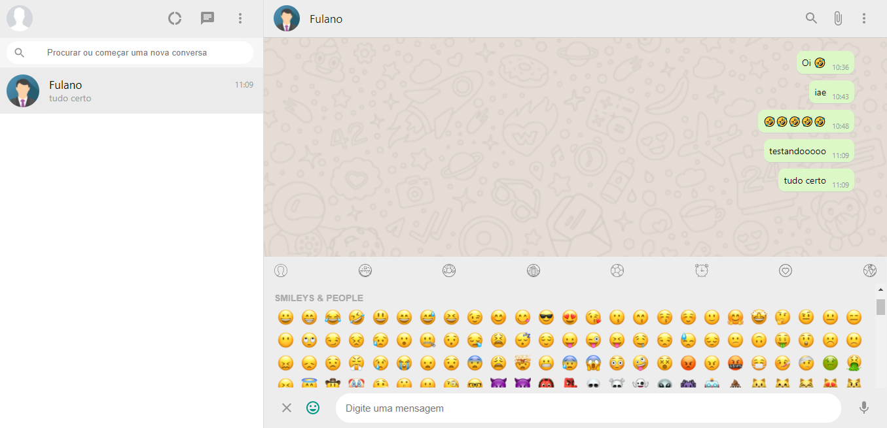

## 🤣 whatsapp-clone

<h1 align="center">
    
</h1>

<p align="center">
  <a href="#technologies">Technologies</a>&nbsp;&nbsp;&nbsp;|&nbsp;&nbsp;&nbsp;
  <a href="#-preview">Preview</a>&nbsp;&nbsp;&nbsp;|&nbsp;&nbsp;&nbsp;
  <a href="#-layout">Getting started</a>&nbsp;&nbsp;&nbsp;|&nbsp;&nbsp;&nbsp;
  <a href="#-project">Project</a>&nbsp;&nbsp;&nbsp;
</p>
<br>

## 🧪 Technologies

This project was developed using the following technologies:

- [React](https://reactjs.org)
- [emoji-picker-react](https://github.com/ealush/emoji-picker-react)
- [MATERIAL-UI](https://material-ui.com/)
- [Firebase](https://firebase.google.com/)

## 🔥 Preview

[](https://whatsapp-clone-viniciuscbb.vercel.app/)

## 🚀 Getting started

Clone the project and access the folder

```bash
$ git clone https://github.com/viniciuscbb/whatsapp-clone.git
```

Follow the steps below
```bash
# Install the dependencies
$ yarn
# Start the project
$ yarn start
```

## 💻 Project

[whatsapp-clone](https://whatsapp-clone-viniciuscbb.vercel.app/) check the result! 💜 

This is a project developed during the **[🔥 Clone do Whatsapp + Firebase em ReactJS para iniciantes](https://www.youtube.com/watch?v=BkX4niTo9Ow)**, presented by **[@Bonieky Lacerda](https://b7web.com.br/fullstack/)**

<p align="center">Made with 💜 by viniciuscbb</p>